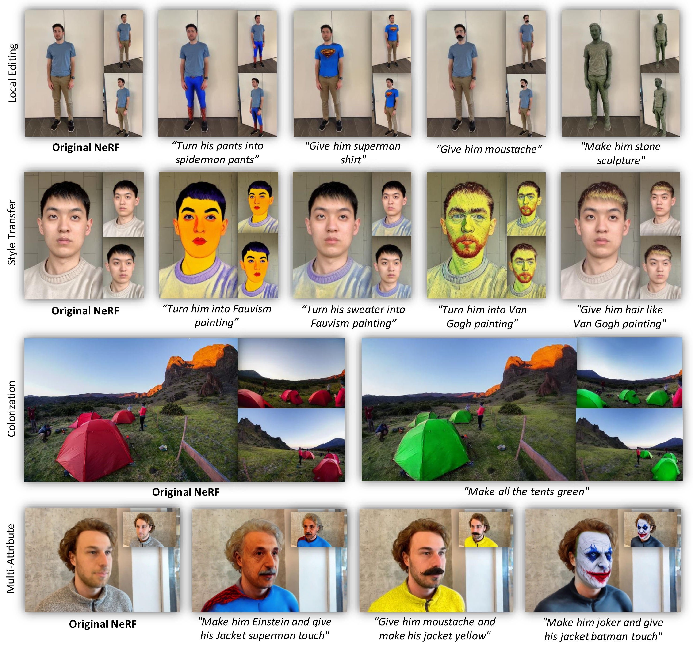
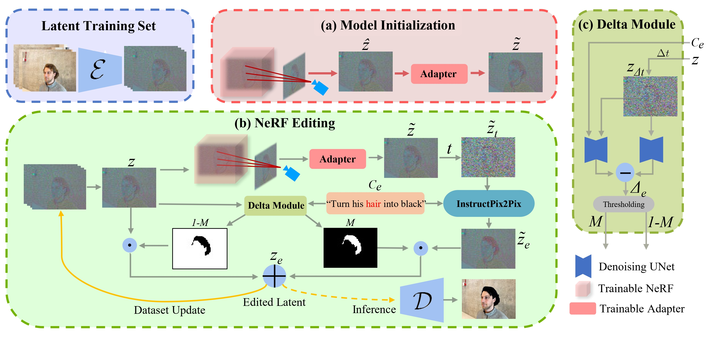
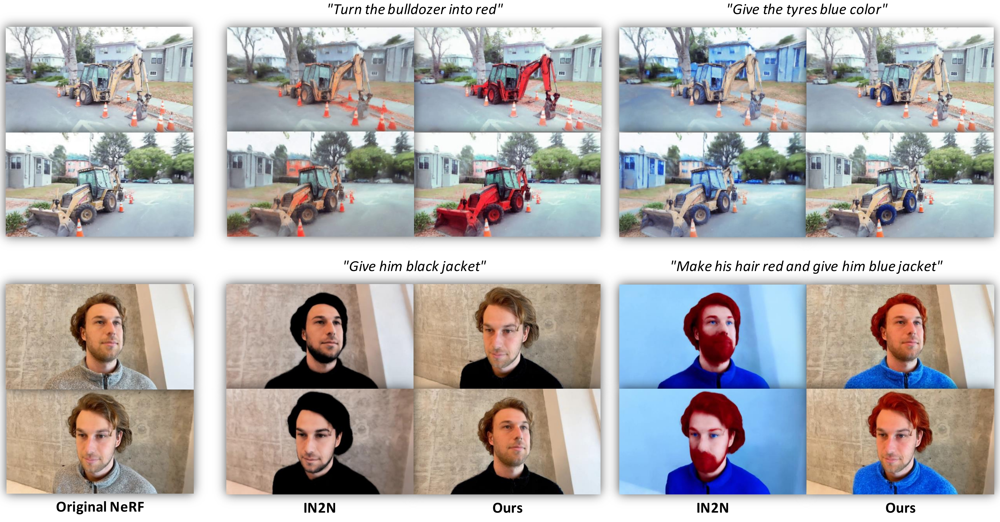
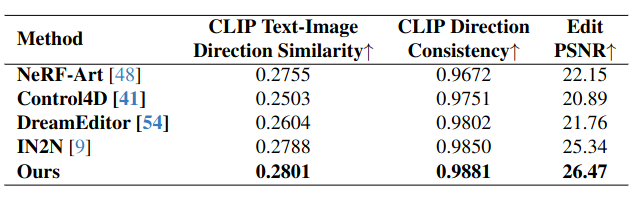

<h2 align="center"> <a href="https://github.com/umarkhalidAI/LatentEditor">LatentEditor: Text Driven Local Editing of 3D Scenes</a></h2>
<h5 align="center"> If you like our project, please give us a star ⭐ on GitHub for latest update.  </h2>

<h5 align="center">

[](https://latenteditor.github.io/)
[](https://arxiv.org/abs/2312.09313)
[](https://github.com/umarkhalidAI/LatentEditor/blob/main/LICENSE) 


</h5>

## [Project page](https://latenteditor.github.io/) | [Paper](https://arxiv.org/abs/2312.09313) 




## 😮 Highlights

LatentEditor allows you to edit your 3D scenes in the matter of **minutes!**.


### 💡 View consistent, high quality and fast speed
- Stable Diffusion for high quality and controllable repainting for reference alignment   -->   view-consistent high-quality image generation.
- View-consistent high-quality images with simple MSE loss   -->   fast high-quality 3D content reconstruction.


## 🚩 **Updates**

Welcome to **watch** 👀 this repository for the latest updates.

✅ **[2023.12.18]** : We have released our paper, LatentEditor on [arXiv](https://arxiv.org/abs/2312.09313).

✅ **[2023.12.18]** : Release [project page](https://latenteditor.github.io/).
- [ ] Code release.

## 🛠️ Methodology


Overall pipeline of LatentEditor for model initialization and editing. (a) We initialize the NeRF model within the latent domain, guided by the latent features of the original dataset. Our refinement adapter mitigates the misalignment in the latent space and encompasses a trainable adapter with residual and self-attention mechanisms. (b) Upon initialization, LatentEditor iteratively refines the model within the latent space for a predetermined number of iterations, while consistently updating the training set with the edited latents, Ze. (c) The Delta Module is adept at interpreting prompts and produces the mask for targeted editing. Additionally, it integrates the denoising U-Net from IP2P. However, ∆t used in calculating delta scores ∆e is a hyperparameter and is different from t which is randomly selected. An RGB image can be obtained by feeding the edited latent to the stable diffusion (SD) decoder D whereas E represents SD encoder.

## 🚀 3D-Editing Results

### Qualitative comparison



### Quantitative comparison


Quantitative evaluation of scene edits in terms of text alignment and frame consistency in CLIP space where our approach demonstrates the highest consistency.

## 👍 **Acknowledgement**
This work is built on many amazing research works and open-source projects, thanks a lot to all the authors for sharing!
* [InstructPix2Pix](https://github.com/timothybrooks/instruct-pix2pix)
* [Instruct-NeRF2NeRF](https://github.com/ayaanzhaque/instruct-nerf2nerf)
* [Diffusers](https://github.com/huggingface/diffusers)

## ✏️ Citation
If you find our paper and code useful in your research, please consider giving a star :star: and citation :pencil:.

```BibTeX
@misc{khalid2023latenteditor,
      title={LatentEditor: Text Driven Local Editing of 3D Scenes}, 
      author={Umar Khalid and Hasan Iqbal and Nazmul Karim and Jing Hua and Chen Chen},
      year={2023},
      eprint={2312.09313},
      archivePrefix={arXiv},
      primaryClass={cs.CV}
}
```
<!---->
